# BXDP Database ERD

```mermaid
erDiagram
  USERS {
    UUID user_id PK
    UUID org_id FK
    STRING first_name
    STRING last_name
    STRING user_email
    STRING password
    STRING profile_url
    STRING profile_img
    BOOLEAN password_reset_required
    BOOLEAN mou
    BOOLEAN is_approved
    BOOLEAN is_active
    BOOLEAN is_logged_in
    BOOLEAN is_meta_admin
    BOOLEAN is_bxdp_admin
    BOOLEAN is_org_admin
    BOOLEAN is_org_manager
    BOOLEAN is_org_user
    BOOLEAN is_user
    BOOLEAN was_invited
    BOOLEAN email_cofirmed
    BOOLEAN profile_cofirmed
    BOOLEAN settings_confirmed
    STRING invite_token
    BOOLEAN is_token_used
  }

  ORGANIZATIONS {
    UUID org_id PK
    UUID user_id
    STRING name
    STRING description
    STRING website
    INTEGER phone
    STRING address
    INTEGER zipcode
    STRING info_email
    BOOLEAN mou
    STRING logo_url
    STRING banner_url
    BOOLEAN digital_services
    BOOLEAN is_featured
    BOOLEAN is_approved
    BOOLEAN is_rejected
    BOOLEAN is_active
    BOOLEAN hidden
    BOOLEAN was_invited
    STRING invite_token
    BOOLEAN is_token_used
  }

  PROFILES {
    UUID profile_id PK
    UUID user_id FK
    BOOLEAN past_experience
    STRING portfolio
    STRING education_level
    BOOLEAN college_in_stem
    STRING income_level
    DATE date_of_birth
    STRING gender
    STRING address
    INTEGER zipcode
    STRING experience_Level
    STRING availability
    STRING learning_style
    STRING preferred_language
    STRING LinkedIn
    BOOLEAN employment_status
  }

  PROGRAMS {
    UUID program_id PK
    UUID org_id FK
    STRING name
    STRING description
    STRING banner_url
    STRING requirements
    DATE enrollment_deadline
    DATE start_date
    DATE end_date
    TIME start_time
    TIME end_time
    ARRAY week_days
    STRING location
    STRING video_call_link
    BOOLEAN is_virtual
    BOOLEAN is_featured
    BOOLEAN is_approved
    BOOLEAN is_rejected
    BOOLEAN is_active
  }

  EVENTS {
    UUID event_id PK
    UUID org_id FK
    STRING name
    STRING description
    STRING banner_url
    STRING location
    STRING rsvp_link
    BOOLEAN is_virtual
    BOOLEAN is_featured
    BOOLEAN is_approved
    BOOLEAN is_rejected
    BOOLEAN is_active
  }

  EVENT_DAYS {
    UUID event_id FK
    DATE date
    TIME start_time
    TIME end_time
  }

  SKILLS {
    UUID skill_id PK
    STRING name
    STRING icon_url
    STRING default_value
  }

  TAGS {
    UUID tag_id PK
    STRING name
  }

  CATEGORIES {
    UUID category_id PK
    STRING title
  }

  RESOURCES {
    UUID resource_id PK
    STRING title
    STRING description
    STRING location
    STRING link
    STRING photo
    STRING provider
    BOOLEAN is_platform_wide
    BOOLEAN is_active
  }

  IMAGES {
    UUID image_id PK
    UUID org_id FK
    UUID program_id FK
    UUID event_id FK
    UUID skill_id FK
    STRING name
    TEXT description
    STRING url
    STRING type
    DATE expiresAt
  }

  VIDEOS {
    UUID video_id PK
    UUID org_id FK
    STRING name
    STRING description
    STRING link
    STRING image_url
  }

  ROLES {
    UUID role_id PK
    STRING name
  }

  INTERESTS {
    UUID interest_id PK
    STRING type
    STRING name
  }

  CAREERS {
    UUID career_id PK
    STRING name
  }

  REQUIREMENTS {
    UUID requirements_id PK
    BOOLEAN past_experience
    STRING education_level
    INTEGER max_income_level
    INTEGER min_income
    INTEGER max_age
    INTEGER min_age
    STRING gender
    STRING experience_Level
    STRING city
    INTEGER zipcode
    STRING radius
  }

  CASES {
    UUID case_id PK
    UUID user_id
    STRING reason
  }

  RESET_PASSWORD_TOKENS {
    UUID reset_id PK
    UUID user_id FK
    STRING reset_first_name
    STRING reset_last_name
    STRING reset_email
    STRING reset_token
    BOOLEAN is_token_used
  }

  INVITE_TOKENS {
    UUID invite_id PK
    UUID user_id FK
    STRING invite_first_name
    STRING invite_last_name
    STRING invite_email
    STRING invite_token
    BOOLEAN is_token_used
  }

  CHANGE_PASSWORD_TOKENS {
    UUID change_id PK
    UUID user_id FK
    STRING change_first_name
    STRING change_last_name
    STRING change_email
    STRING change_token
    BOOLEAN is_token_used
  }

  RSVP {
    UUID event_id FK
    UUID user_id FK
  }

  APPLICANTS {
    UUID program_id FK
    UUID user_id FK
  }

  TOPICS {
    UUID program_id FK
    UUID skill_id FK
    STRING description
  }

  TAG_EVENT {
    UUID event_id FK
    UUID tag_id FK
  }

  PROFILE_SKILL {
    UUID profile_id FK
    UUID skill_id FK
  }

  PROFILE_ROLE {
    UUID profile_id FK
    UUID role_id FK
  }

  PROFILE_INTEREST {
    UUID profile_id FK
    UUID interest_id FK
  }

  PROFILE_TAG {
    UUID profile_id FK
    UUID tag_id FK
  }

  TAG_RESOURCE {
    UUID tag_id FK
    UUID resource_id FK
  }

  CATEGORY_RESOURCE {
    UUID category_id FK
    UUID resource_id FK
  }

  ORG_RESOURCE {
    UUID org_id FK
    UUID resource_id FK
  }

  USER_RESOURCE {
    UUID user_id FK
    UUID resource_id FK
  }

  EVENT_REQUIREMENTS {
    UUID event_id FK
    UUID requirements_id FK
  }

  PROGRAM_REQUIREMENTS {
    UUID program_id FK
    UUID requirements_id FK
  }

  E_CASE {
    UUID event_id FK
    UUID case_id FK
  }

  P_CASE {
    UUID program_id FK
    UUID case_id FK
  }

  O_CASE {
    UUID org_id FK
    UUID case_id FK
  }

  VIDEO_TAG {
    UUID video_id FK
    UUID tag_id FK
  }

  USERS }o--|| ORGANIZATIONS : "org_id belongsTo"
  PROFILES ||--|| USERS : "1-1 user_id"
  USERS }o--o{ EVENTS : "via RSVP"
  USERS }o--o{ PROGRAMS : "via APPLICANTS"

  ORGANIZATIONS ||--o{ PROGRAMS : "hasMany"
  ORGANIZATIONS ||--o{ EVENTS : "hasMany"
  ORGANIZATIONS ||--o{ VIDEOS : "hasMany"
  ORGANIZATIONS }o--o{ RESOURCES : "via ORG_RESOURCE"

  EVENTS ||--o{ EVENT_DAYS : "hasMany"
  EVENTS }o--o{ TAGS : "via TAG_EVENT"
  EVENTS }o--o{ REQUIREMENTS : "via EVENT_REQUIREMENTS"

  PROGRAMS }o--o{ SKILLS : "via TOPICS"
  PROGRAMS }o--o{ REQUIREMENTS : "via PROGRAM_REQUIREMENTS"

  PROFILES }o--o{ SKILLS : "via PROFILE_SKILL"
  PROFILES }o--o{ ROLES : "via PROFILE_ROLE"
  PROFILES }o--o{ INTERESTS : "via PROFILE_INTEREST"
  PROFILES }o--o{ TAGS : "via PROFILE_TAG"

  TAGS }o--o{ RESOURCES : "via TAG_RESOURCE"
  CATEGORIES }o--o{ RESOURCES : "via CATEGORY_RESOURCE"
  USERS }o--o{ RESOURCES : "via USER_RESOURCE"

  CASES }o--o{ EVENTS : "via E_CASE"
  CASES }o--o{ PROGRAMS : "via P_CASE"
  CASES }o--o{ ORGANIZATIONS : "via O_CASE"

  IMAGES }o--|| ORGANIZATIONS : "org image"
  IMAGES }o--|| PROGRAMS : "program image"
  IMAGES }o--|| EVENTS : "event image"
  IMAGES }o--|| SKILLS : "skill image"

  VIDEOS }o--o{ TAGS : "via VIDEO_TAG"
```

Notes
- This ERD reflects the Sequelize models and their associations as defined in `backend/models`.
- Field types are indicative; actual SQL types may vary by dialect (SQLite/Postgres/MySQL).
- Join tables are shown explicitly to make many-to-many relationships clear.

How to View
- GitHub/VS Code: Open this file to render Mermaid automatically in Markdown preview.
- VS Code: Press `Ctrl+Shift+V` in this file to preview. If Mermaid does not render, add the "Markdown Preview Mermaid Support" extension.
- Browser: Paste the diagram block into mermaid.live to export PNG/SVG.

